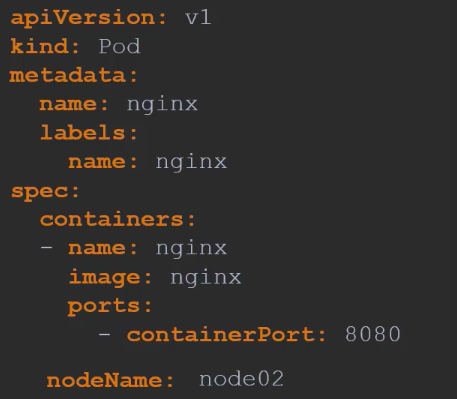
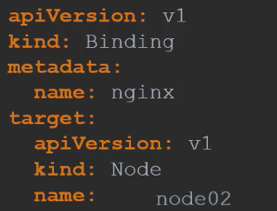

# Scheduling
## Manual Scheduling
Scheduling means making usre pods are matched to nodes so that they can be run. They can handle pods from different namespaces. 

- We can specify the node in the initial YAML file:

- We can also create a file to bind the pod to a node:

Here we specify the node, and bind it to 