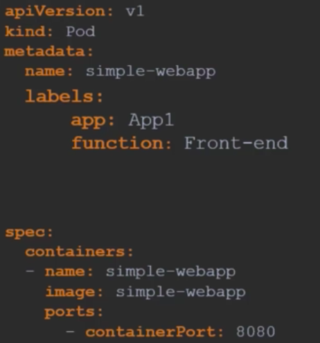
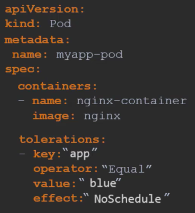
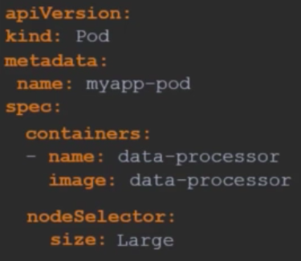

# Scheduling
## Manual Scheduling
Scheduling means making usre pods are matched to nodes so that they can be run. They can handle pods from different namespaces. 

- We can specify the node in the initial YAML file:

# Labels and selectors
- Objects are things within kubernetes like pods and services.
- We can add as many labels as we like to our objects: 

- You can search for the Pod by: `kubectl get pods --selector app=App1`
- As part of metadata, we can also add `annotations`.

# Taints and Tolerations

- Taints and tolerations are used to set restrictions on what pods can be scheduled on a node.
- If we want only certain Pods on a particular node, we can place a taint on the node, and by default, Pods do not have any tolerations, therefore they cannot go to that node with the taint.
- When we set a taint on a node, all existing Pods without the right toleration will be removed. 
- JUst because we have restricted a node from accepting certain Pods, it doesn't guarentee that the Pods with the right toleration will be placed on them. 
- The scheduler never sets a Pod onto the master node because it comes with an automatic taint attached to it. 

- We can set a taint on a Node with the following:
`kubectl taint nodes node-name Key=value:taint-effect`
`kubectl taint nodes node1 app=blue:NoSchedule`
Here we set node1, with a key-value pair app=blue, and a taint effect of NoSchedule. 
- The taint effects are:
    - NoSchedule = Pods will not be scheduled on the node. (Unless they have the correct toleration)
    - PreferNoSchedule = It will try not to schedule pod onto node but not guaranteed.
    - NoExecute = New pods will not be scheduled and existing pods (if any) will be evicted.

- When setting toleration, it looks like: 

# Node selectors
- We can place our pods on specific nodes. 
- We need to first assign a label to our nodes, which we can do by:
`kubectl label nodes <node-name> <label-key>=<label-value>`
- We can then choose where our Pod goes in the definition file:

- Here, the node we want to assign to has a key: pair of size:Large. 
- The process is limited however, as we can't specify that a Pod can be placed on different Nodes, only one. 

# Node affinity
- It provides advanced capabilities to limit pod placement on specific nodes.